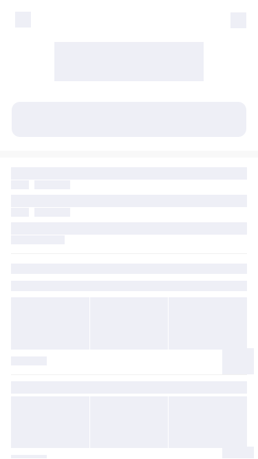

#### 根据 url 自动生成骨架屏
#### 百度首页生成效果
    生成节点不准确，遇到错误需多生成几次即可，依赖页面本身编写的样式

#### 百度首页生成效果



#### 配置：

|multyUrls|通用数组目录url必填默认当前的所有配置|true|
|url|单个生成|false|
|output|生成目录|true|
|sleepTime|延迟生成|false|
|loadDestory|挂载卸载|false|
|disabledScript|不生成所有的 script 标签|false|
|device|生成的样式|['device', 'pc']|
|savePicture|保存生成的骨架图片|false|
|pageShowContain|骨架屏展示的设备|['mobile', 'pc']|
|backgroundColor|骨架屏生成内容区域的背景色|false|
|createAll|默认截取dom的可视化窗口的50%|false|
|isCDN|使用CDN方式引入|false|
|injectDOMNode|插入dom的位置|body|
#### use:

```javascript
const skeleton = require('auto-skeleton-mm')
const skeletonConfig = {
    multyUrls: [
        // 自动匹配外侧中配置
        {
            url: 'https://www.baidu.com',
            filename: 'baidu-index',
            fileDir: './baidu-skeleton',
            extraHTTPHeaders: {},
            injectSelector: ''
        },
        {
            url: 'https://www.google.com/',
            filename: 'chrome-index',
            fileDir: './baidu-skeleton',
            extraHTTPHeaders: {},
            injectSelector: ''
        }
    ],
    url: 'https://www.baidu.com',
    filename: 'baidu-index',
    fileDir: './baidu-skeleton',
    injectSelector: 'skeleton',
    backgroundColor: '#EEEFF7',
    sleepTime: 500,
    loadDestory: false,
    device: 'mobile',
    lineHeight: 22,
    disabledScript: true,
    createAll: false,
    savePicture: true,
    pageShowContain: ['mobile'], // mobile, pc
}

new Skeleton().init(
    skeletonConfig
)
```
#### 生成代码自动注入：

```javascript
const Skeleton = require('auto-skeleton-mm')
...
plugins: [
  new Skeleton({
      headTags: [],
      bodyTags: [{
          tagName: 'div',
          closeTag: true,
          attributes: {
              id: 'skeleton'
          },
          tagCode: ...
      }]
  })
]
...
```
参考：draw-page-structure


